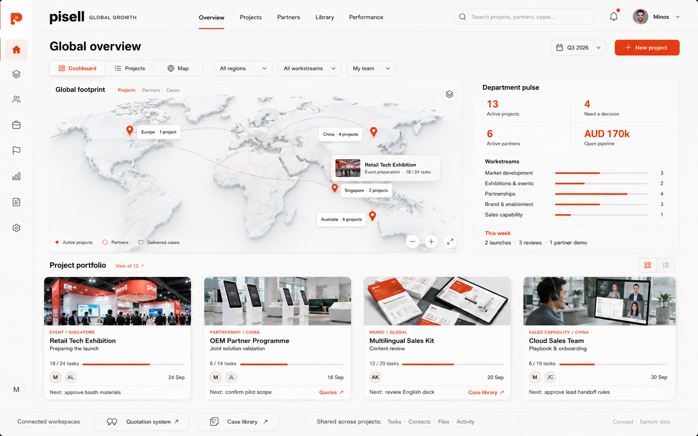

# Pisell Global Growth

12 September 2026: the integrated workspace implements the approved homepage, exhibition opportunities and venue discovery on Cloudflare Workers, D1 and R2. See [Workbench](workbench/README.md) for scope, setup and validation. The original business specifications below remain the operating reference.

- [目标与工作关系](docs/OPERATING-MODEL.md)：当前业务层级，区分目标、工作组、任务、交付物与最终收入成果；取代 v1 平铺工作图。

- [可执行工作目录](docs/WORK-CATALOG.md)：沿主线拆解具体工作、参展 Level、谈判与云销售、Skill 与人工分工。
- [UI 体系说明](design-system/pisell-global-growth/MASTER.md)：视觉、页面、组件、状态、反馈和复用原则。
- [Overview 规范](design-system/pisell-global-growth/pages/overview.md)：Dashboard / Projects / Map。
- [统一详情规范](design-system/pisell-global-growth/pages/project-detail.md)：任务、资料、人员、报价引用与活动记录。
- [技能采用记录](design-system/pisell-global-growth/SKILL-APPLICATION.md)：实际采用的能力、范围和排除的偏题建议。
- [验证清单](design-system/pisell-global-growth/VALIDATION.md)：本轮核对与下一阶段验收。

